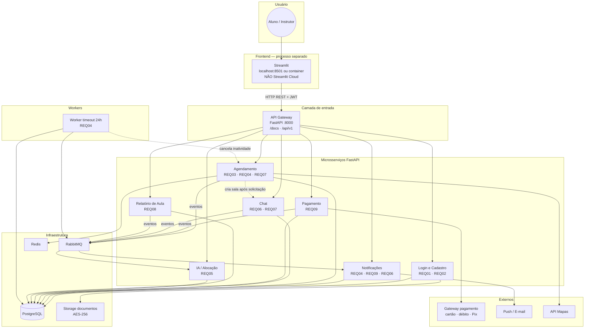
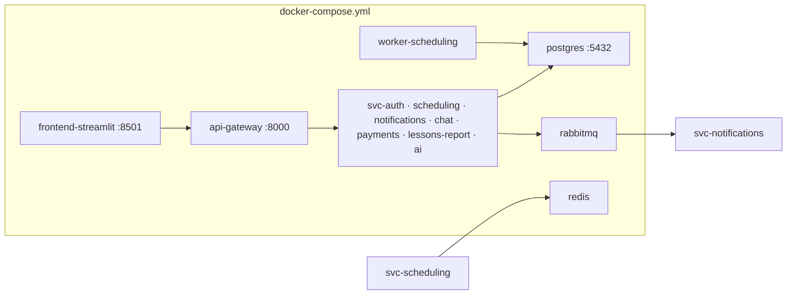
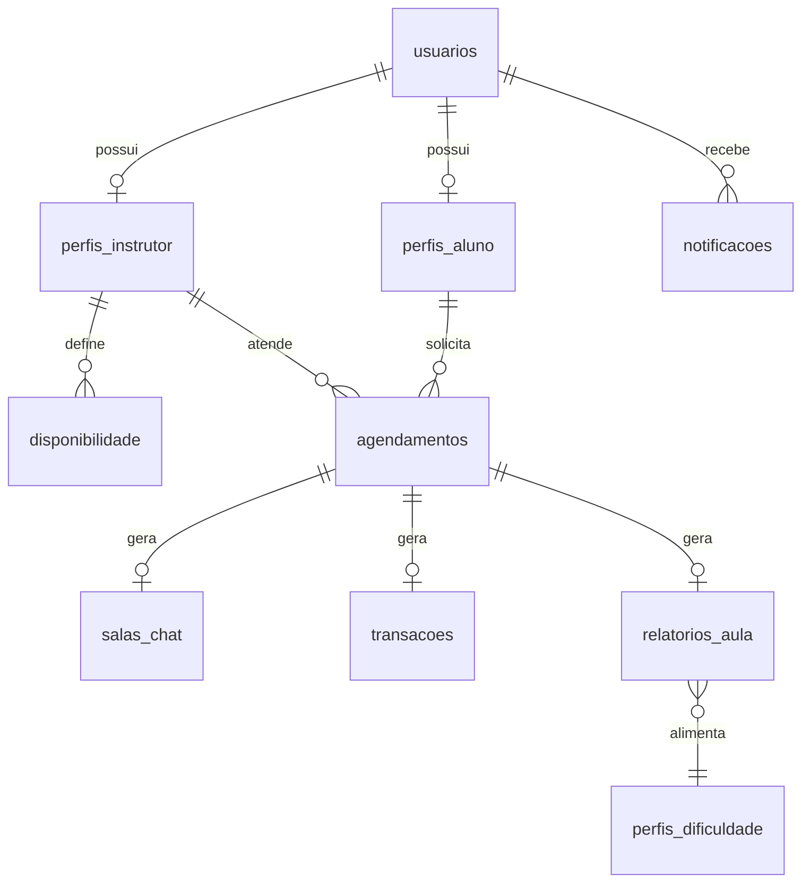

# Arquitetura e implementação do backend — Quero Dirigir

Documento de **arquitetura de referência** para o desenvolvimento do sistema **Quero Dirigir** (marketplace que conecta alunos a instrutores autônomos para aulas práticas de CNH). A partir deste blueprint serão implementados:

- **Backend:** microsserviços em **FastAPI**
- **Frontend:** aplicativo em **Streamlit** (execução local ou em container Docker — **não** utilizamos Streamlit Cloud)
- **Banco de dados:** **PostgreSQL** (sem Supabase)
- **Infraestrutura:** Dockerfiles, `docker-compose` e pipelines CI/CD

Base normativa: requisitos funcionais e não funcionais de **Cópia de Requisitos v4** (`docs/requisitos.md`).

---

## A) Arquitetura do sistema

### A.1 Visão geral

| Decisão | Escolha |
|---------|---------|
| Estilo arquitetural | Microsserviços (REQ12) |
| API | REST + JSON; OpenAPI 3 gerado pelo FastAPI |
| Persistência | **PostgreSQL 16** — um cluster, **schemas separados** por microsserviço |
| Entrada única para o frontend | **API Gateway** (FastAPI, porta `8000`) |
| Frontend | **Streamlit** em processo/container próprio (porta `8501`) |
| Mensageria | RabbitMQ (eventos entre agendamento, pagamento, chat, relatórios e notificações) |
| Cache | Redis (busca geográfica de instrutores — REQ10) |
| Documentos (CNH, CRLV) | Volume Docker ou storage S3-compatible com **AES-256** (REQ11) |
| Deploy local | `docker compose up` sobe Postgres, fila, Redis, microsserviços, gateway e Streamlit |

### A.2 Diagrama de arquitetura (microsserviços e setas)



### A.3 Microsserviços e mapeamento de requisitos

#### 1. Módulo de login e cadastro (aluno e instrutor)

| REQ | Responsabilidade |
|-----|------------------|
| **REQ01** | Cadastro de aluno: nome, e-mail, telefone, CPF, senha, endereço do ponto de encontro; validação de formato; unicidade CPF/e-mail; retorno com token para área logada |
| **REQ02** | Solicitação de perfil instrutor: categorias A/B, veículo próprio, uploads condicionais (CRLV, foto do veículo), CNH e credencial; status **Em Análise** até aprovação |

- **Schema PostgreSQL:** `auth`
- **Porta interna (dev):** `8001`
- **Tabelas principais:** `usuarios`, `perfis_aluno`, `perfis_instrutor`, `solicitacoes_instrutor`, `documentos_instrutor`

---

#### 2. Módulo de notificações

Centraliza avisos in-app (lista no Streamlit) e canais push/e-mail:

| Evento | Requisito |
|--------|-----------|
| Nova solicitação de aula ao instrutor | REQ04 |
| Confirmação da aula ao aluno | REQ04 |
| Recusa da aula ao aluno | REQ04 |
| Cancelamento pelo aluno | REQ04 |
| Cancelamento por recusa do instrutor | REQ04 |
| Cancelamento automático (sem resposta até **24 h antes** da aula) | REQ04 |
| Pagamento confirmado / reembolso | REQ09 |
| Nova mensagem no chat | REQ06 |
| Avaliações e feedback (ex.: nova nota, relatório disponível) | REQ06 / REQ08 |

- **Schema:** `notifications`
- **Porta:** `8002`
- **Tabelas:** `notificacoes`, `templates`, `entregas`

Consome eventos da fila; não bloqueia o fluxo síncrono do agendamento.

---

#### 3. Módulo de chat integrado

| REQ | Comportamento |
|-----|---------------|
| **REQ06** | Chat habilitado **após** solicitação de aula; mensagens **texto** e **localização**; notificação de novas mensagens (via módulo de notificações) |
| **REQ07** | Coordenadas/endereço exato no chat só após status **Confirmado** |

- **Schema:** `chat`
- **Porta:** `8003`
- **Tabelas:** `salas` (1:1 com `agendamento_id`), `mensagens`

---

#### 4. Módulo de agendamento de aulas

| REQ | Comportamento |
|-----|---------------|
| **REQ03** | Busca (categoria, bairro/região, modalidade veículo); só instrutores **Aprovado**; ordenação secundária; cards; perfil com agenda; solicitação → **Aguardando Confirmação** + evento para notificações |
| **REQ04** | Aceitar → **Confirmado** + bloqueio de slot; Recusar → motivo + **Cancelado** + libera slot |
| **REQ07** | Antes da confirmação: só bairro/região; fluxo “manter endereço?”; após confirmação: endereço completo e mapa |

- **Schema:** `scheduling`
- **Porta:** `8004`
- **Tabelas:** `disponibilidade`, `agendamentos`, `enderecos_encontro`, `avaliacoes_publicas`
- **Worker:** cancelamento automático por inatividade (REQ04)

---

#### 5. Módulo de pagamento

| REQ | Comportamento |
|-----|---------------|
| **REQ09** | Crédito, débito, Pix; valor antes de confirmar; pagamento só com aula **Confirmada**; comprovante; repasse após conclusão; reembolso 100% (&lt; 24 h) ou 80%; log de auditoria |

- **Schema:** `payments`
- **Porta:** `8005`
- **Tabelas:** `transacoes`, `comprovantes`, `repasses`, `logs_auditoria`

---

#### 6. Módulo de relatório de aula

| REQ | Comportamento |
|-----|---------------|
| **REQ08** | baliza, percurso, embreagem, observações; pontos fortes e a melhorar; visibilidade após nova solicitação de aula; alimenta IA (REQ05) |

- **Schema:** `lessons_report`
- **Porta:** `8006`
- **Tabelas:** `relatorios`, `habilidades`

---

#### 7. Módulo de IA / alocação inteligente

| REQ | Comportamento |
|-----|---------------|
| **REQ05** | Análise de relatórios; destaque de instrutores nos pontos fracos do aluno; **Dashboard de Evolução** com probabilidade estimada de aprovação no Detran |

- **Schema:** `ai`
- **Porta:** `8007`
- **Tabelas:** `perfis_dificuldade`, `scores_match`, `historico_evolucao`

---

### A.4 Implantação com Docker (visão alvo)



| Container | Dockerfile | Função |
|-----------|------------|--------|
| `postgres` | imagem oficial | Banco `querodirigir` |
| `api-gateway` | `backend/gateway/Dockerfile` | Roteamento `/api/v1` |
| `svc-*` | `backend/services/<nome>/Dockerfile` | Um microsserviço por imagem |
| `frontend-streamlit` | `frontend/Dockerfile` | `streamlit run app.py --server.port=8501` |
| `worker-scheduling` | `backend/workers/scheduling_timeout/Dockerfile` | Job REQ04 (24 h) |

Variáveis no Streamlit (`.env` do frontend):

```env
API_BASE_URL=http://api-gateway:8000/api/v1
```

Em desenvolvimento local sem Docker: `API_BASE_URL=http://localhost:8000/api/v1`.

---

### A.5 Modelo de dados PostgreSQL

Um cluster **PostgreSQL**; cada microsserviço é dono de um **schema** (migrações Alembic independentes).



#### Dados armazenados (mínimo exigido + complementos)

| Domínio | O que persiste |
|---------|----------------|
| Usuários | Dados de cadastro REQ01; perfis aluno/instrutor REQ02 |
| Agendamentos por aluno | Histórico e status de solicitações |
| Agendamentos por instrutor | Solicitações pendentes, confirmadas, canceladas; bloqueios de agenda |
| Pagamentos | Transações, comprovantes, repasses, auditoria |
| Chat | Salas e mensagens por agendamento |
| Relatórios | Notas por habilidade e texto para IA |
| Notificações | Fila lida pelo Streamlit |
| IA | Scores e evolução para dashboard REQ05 |

**Índices (REQ10):** `(bairro_regiao, categoria)` + `status = Aprovado`; `(instrutor_id, data_hora_inicio)`; cache Redis na busca.

---

### A.6 Fluxos principais (setas entre componentes)

**Solicitar aula**

```
Streamlit → Gateway → Agendamento: POST /solicitacoes
Agendamento → PostgreSQL (Aguardando Confirmação)
Agendamento → RabbitMQ → Notificações (instrutor)
Agendamento → Chat: cria sala
```

**Instrutor aceita**

```
Streamlit → Gateway → Agendamento: PATCH /aceitar
Agendamento → PostgreSQL (Confirmado, bloqueia slot)
Agendamento → RabbitMQ → Notificações (aluno)
Endereço completo liberado (REQ07)
Streamlit → Gateway → Pagamento (somente se Confirmado)
```

**Timeout 24 h (REQ04)**

```
Worker → PostgreSQL: Cancelado por inatividade
Worker → RabbitMQ → Notificações (aluno + instrutor)
Agendamento: libera slot
```

**Pós-aula**

```
Streamlit (instrutor) → Relatório: POST
Relatório → RabbitMQ → IA
Pagamento: repasse após aula concluída
```

---

### A.7 Requisitos não funcionais

| REQ | Implementação na arquitetura |
|-----|------------------------------|
| **REQ10** | Réplicas de containers; auto-scaling CPU &gt; 70%; Redis na busca; meta 2 s |
| **REQ11** | AES-256 em documentos; endereço mascarado até confirmação; `logs_auditoria` |
| **REQ12** | 7 microsserviços + gateway; OpenAPI por serviço; deploy independente |
| **REQ13** | GitHub Actions (testes → build imagens → deploy); Prometheus/Grafana; alerta 5 min em pagamento, chat, agendamento, notificação; logs estruturados em ≥ 90% dos serviços |

---

## B) Respostas — PRO3151 prompt para arquitetura

### 1.1 Estrutura de pastas e separação de responsabilidades

#### Organização física do código

```
backend-grupo1/
├── frontend/                              # Streamlit — processo Docker separado
│   ├── Dockerfile
│   ├── requirements.txt                   # streamlit, requests, httpx
│   ├── .env.example                       # API_BASE_URL=
│   └── app/
│       ├── main.py                        # st.set_page_config, navegação
│       ├── api_client.py                  # Chamadas HTTP ao Gateway
│       ├── session.py                     # Token JWT em st.session_state
│       └── pages/
│           ├── 01_cadastro_login.py       # REQ01
│           ├── 02_perfil_instrutor.py     # REQ02
│           ├── 03_busca_agenda.py         # REQ03
│           ├── 04_solicitacoes.py         # REQ04 (instrutor)
│           ├── 05_chat.py                 # REQ06
│           ├── 06_pagamento.py            # REQ09
│           ├── 07_relatorio.py            # REQ08
│           ├── 08_dashboard_ia.py         # REQ05
│           └── 09_notificacoes.py
│
├── backend/
│   ├── gateway/
│   │   ├── Dockerfile
│   │   ├── main.py
│   │   └── routers/                       # Proxy /api/v1 → microsserviços
│   ├── services/
│   │   ├── auth/                          # REQ01, REQ02
│   │   ├── scheduling/                    # REQ03, REQ04, REQ07
│   │   ├── notifications/
│   │   ├── chat/
│   │   ├── payments/
│   │   ├── lessons_report/
│   │   └── ai/
│   ├── workers/
│   │   └── scheduling_timeout/
│   └── shared/                            # JWT, schemas Pydantic, cliente MQ
│
├── database/
│   ├── init/01-schemas.sql                # CREATE SCHEMA auth, scheduling, ...
│   └── seeds/dev_seed.sql
│
├── infra/
│   ├── docker-compose.yml
│   └── prometheus/
│
├── .github/workflows/ci.yml
├── docs/requisitos.md
├── .env.example
└── README.md
```

> **Nota:** arquivos legados na raiz do repositório (ex.: protótipo antigo) **não** fazem parte desta arquitetura; o frontend oficial fica em `frontend/app/`.

#### Por que frontend (Streamlit) e backend rodam em processos separados?

1. **REQ12 — microsserviços:** o Streamlit é apenas **cliente HTTP**; regras de negócio (CPF duplicado, pagamento só após confirmação, cancelamento 24 h) ficam no FastAPI + PostgreSQL.
2. **Escalabilidade (REQ10):** em pico de agendamentos escalamos `svc-scheduling` e o gateway sem duplicar instâncias da UI.
3. **Segurança (REQ11):** `DATABASE_URL` e chaves do PSP **nunca** entram no container Streamlit; só `API_BASE_URL` e o JWT do usuário em `st.session_state`.
4. **Tecnologias adequadas:** Streamlit para protótipo e MVP de telas rápidas; FastAPI para APIs tipadas, transações e integrações.
5. **Docker independente:** `docker compose up` sobe `frontend-streamlit` e `api-gateway` em redes distintas; o Streamlit **não** usa Streamlit Cloud — roda na máquina da equipe ou no servidor do grupo via container.
6. **CI/CD (REQ13):** pipeline testa APIs com `pytest`; o frontend pode ter smoke tests de páginas sem reiniciar os microsserviços.

O **PostgreSQL** é acessado somente pelos microsserviços na rede interna Docker (`backend-network`), nunca pelo navegador ou pelo Streamlit diretamente.

---

### 1.2 Contrato da API (Endpoints e lógica)

Contrato público exposto pelo **API Gateway** sob `/api/v1`. Documentação interativa: **`GET http://localhost:8000/docs`**.

#### Autenticação e cadastro — `auth` (REQ01, REQ02)

| Método HTTP | Rota (Endpoint) | Descrição da funcionalidade | Payload (entrada) | Resposta esperada (sucesso) |
|-------------|-----------------|----------------------------|-------------------|----------------------------|
| POST | `/api/v1/auth/cadastro/aluno` | Cadastra aluno com validações REQ01 | `{"nome": string, "email": string, "telefone": string, "cpf": string, "senha": string, "endereco_encontro": string}` | `{"user_id": uuid, "access_token": string, "token_type": "bearer"}` |
| POST | `/api/v1/auth/login` | Login aluno ou instrutor | `{"email": string, "senha": string}` | `{"access_token": string, "perfil": "aluno" \| "instrutor"}` |
| GET | `/api/v1/auth/me` | Dados do usuário logado | Header: `Authorization: Bearer {token}` | `{"id": uuid, "nome": string, "email": string, "telefone": string}` |
| POST | `/api/v1/auth/instrutor/solicitacao` | Solicitação perfil instrutor REQ02 | `multipart`: categorias, veiculo_proprio, arquivos | `{"solicitacao_id": uuid, "status": "Em Análise", "prazo_resposta_dias": 5}` |
| GET | `/api/v1/auth/instrutor/status` | Status da habilitação | Bearer token | `{"status": "Em Análise" \| "Aprovado" \| "Rejeitado"}` |

#### Agendamento — `scheduling` (REQ03, REQ04, REQ07)

| Método HTTP | Rota | Descrição | Payload (entrada) | Resposta esperada (sucesso) |
|-------------|------|-----------|-------------------|----------------------------|
| GET | `/api/v1/agendamento/instrutores` | Busca instrutores aprovados | Query: `categoria`, `bairro_regiao`, `modalidade_veiculo`, opcional: `ordenar`, `continuidade` | `[{"id": uuid, "nome": string, "foto_url": string, "nota_media": float, "total_aulas": int, "veiculo_proprio": bool}]` |
| GET | `/api/v1/agendamento/instrutores/{id}` | Perfil completo + avaliações | URL: `id` | `{"id": uuid, "descricao_metodo": string, "avaliacoes": [...]}` |
| GET | `/api/v1/agendamento/instrutores/{id}/agenda` | Horários livres | Query: `data_inicio`, `data_fim` | `[{"data": "YYYY-MM-DD", "horarios": ["09:00"]}]` |
| POST | `/api/v1/agendamento/solicitacoes` | Cria solicitação de aula | `{"instrutor_id": uuid, "data_hora_inicio": datetime, "categoria": "A"\|"B", "modalidade_veiculo": string, "manter_endereco": bool, "endereco_encontro"?: string}` | `{"id": uuid, "status": "Aguardando Confirmação"}` |
| GET | `/api/v1/agendamento/solicitacoes/minhas` | Agendamentos do aluno | Bearer | `[{"id": uuid, "instrutor_nome": string, "status": string, "data_hora_inicio": datetime}]` |
| GET | `/api/v1/agendamento/solicitacoes/pendentes` | Painel do instrutor | Bearer (instrutor) | `[{"id": uuid, "aluno": {...}, "data_hora_inicio": datetime, "regiao": string, "categoria": string, "modalidade_veiculo": string, "status": string}]` |
| PATCH | `/api/v1/agendamento/solicitacoes/{id}/aceitar` | Confirma aula REQ04 | URL: `id` | `{"status": "Confirmado"}` |
| PATCH | `/api/v1/agendamento/solicitacoes/{id}/recusar` | Recusa com motivo | `{"motivo": string}` | `{"status": "Cancelado"}` |
| PATCH | `/api/v1/agendamento/solicitacoes/{id}/cancelar` | Cancelamento pelo aluno | URL: `id` | `{"status": "Cancelado"}` |
| GET | `/api/v1/agendamento/solicitacoes/{id}/endereco` | Endereço conforme REQ07 | Bearer | Antes: `{"bairro_regiao": string}` · Depois: `{"endereco_completo": string, "lat": float, "lon": float}` |

#### Notificações — `notifications`

| Método HTTP | Rota | Descrição | Payload | Resposta |
|-------------|------|-----------|---------|----------|
| GET | `/api/v1/notificacoes` | Lista notificações | Bearer | `[{"id": uuid, "tipo": string, "titulo": string, "mensagem": string, "lida": bool, "created_at": datetime}]` |
| PATCH | `/api/v1/notificacoes/{id}/lida` | Marca como lida | — | `{"ok": true}` |

#### Chat — `chat` (REQ06)

| Método HTTP | Rota | Descrição | Payload | Resposta |
|-------------|------|-----------|---------|----------|
| GET | `/api/v1/chat/salas/{agendamento_id}/mensagens` | Histórico | Bearer | `[{"id": uuid, "remetente_id": uuid, "tipo": "texto"\|"localizacao", "conteudo": string, "created_at": datetime}]` |
| POST | `/api/v1/chat/salas/{agendamento_id}/mensagens` | Envia mensagem | `{"tipo": "texto"\|"localizacao", "conteudo": string}` | `{"id": uuid, "created_at": datetime}` |

#### Pagamento — `payments` (REQ09)

| Método HTTP | Rota | Descrição | Payload | Resposta |
|-------------|------|-----------|---------|----------|
| GET | `/api/v1/pagamentos/agendamento/{agendamento_id}/resumo` | Valor antes de pagar | Bearer | `{"valor_total": decimal, "moeda": "BRL", "pode_pagar": bool}` |
| POST | `/api/v1/pagamentos` | Processa pagamento | `{"agendamento_id": uuid, "metodo": "credito"\|"debito"\|"pix", "dados": {...}}` | `{"transacao_id": uuid, "status": "pago", "comprovante_id": uuid}` |
| GET | `/api/v1/pagamentos/comprovante/{id}` | Comprovante digital | Bearer | `{"url_pdf": string, "valor": decimal, "data": datetime}` |
| POST | `/api/v1/pagamentos/{transacao_id}/reembolso` | Reembolso 100% ou 80% | — | `{"status": "reembolsado", "valor_devolvido": decimal, "percentual": 100 \| 80}` |

#### Relatório de aula — `lessons_report` (REQ08)

| Método HTTP | Rota | Descrição | Payload | Resposta |
|-------------|------|-----------|---------|----------|
| POST | `/api/v1/relatorios` | Registra relatório | `{"agendamento_id": uuid, "baliza": int, "percurso": int, "embreagem": int, "observacoes": string, "pontos_fortes": [string], "pontos_melhorar": [string]}` | `{"id": uuid, "visivel_para_aluno": false}` |
| GET | `/api/v1/relatorios/meus` | Relatórios do aluno (regra REQ08) | Bearer (aluno) | `[{...}]` |

#### IA / alocação — `ai` (REQ05)

| Método HTTP | Rota | Descrição | Payload | Resposta |
|-------------|------|-----------|---------|----------|
| GET | `/api/v1/ia/sugestoes-instrutores` | Match inteligente | Query: filtros REQ03 + Bearer | `[{"instrutor_id": uuid, "score": float, "destaque": string}]` |
| GET | `/api/v1/ia/dashboard-evolucao` | Dashboard REQ05 | Bearer (aluno) | `{"probabilidade_aprovacao_detran": float, "medias": {"baliza": float, "percurso": float, "embreagem": float}}` |

#### Erros HTTP padronizados

| Código | Uso |
|--------|-----|
| 400 | Validação (CPF inválido, campos vazios) |
| 401 | Token ausente ou inválido |
| 403 | Regra de negócio (ex.: pagar antes de confirmar) |
| 409 | CPF ou e-mail já cadastrado (REQ01) |

---

### 1.3 Documentação e integração com o frontend em Streamlit

#### Como `/docs` auxilia o desenvolvimento do Streamlit

O FastAPI publica a especificação **OpenAPI 3** em:

- **Swagger UI:** `http://localhost:8000/docs`
- **JSON:** `http://localhost:8000/openapi.json`

Durante o desenvolvimento do frontend Streamlit, a equipe usa `/docs` para:

1. **Consultar o contrato antes de codificar a tela** — por exemplo, ao implementar a busca de instrutores (REQ03), verifica-se em `/docs` os query params obrigatórios (`categoria`, `bairro_regiao`, `modalidade_veiculo`) e o formato da lista retornada.
2. **Testar a API sem interface** — executa-se `POST /auth/cadastro/aluno` no Swagger com payload de exemplo; só depois conecta-se o formulário `st.form` ao mesmo endpoint.
3. **Evitar divergência de nomes** — o schema documentado usa `endereco_encontro`; o `api_client.py` do Streamlit replica exatamente esse nome, evitando erros silenciosos.
4. **Documentar enums de status** — `Aguardando Confirmação`, `Confirmado`, `Cancelado` aparecem no OpenAPI; o Streamlit usa `st.status` ou badges condicionais com os mesmos valores.

#### Como o contrato garante que o Streamlit consuma os dados corretamente

O Streamlit **não acessa o PostgreSQL** e **não implementa regras de negócio**. Toda tela segue o padrão:

```
st.form / st.button → api_client.py → HTTP → API Gateway → microsserviço → PostgreSQL
```

| Requisito | Garantia via contrato + Streamlit |
|-----------|-----------------------------------|
| REQ01 — campos obrigatórios | `st.form` valida preenchimento local; API retorna `409` se CPF/e-mail duplicado → `st.error(resp["detail"])` |
| REQ03 — só aprovados | `GET /instrutores` já filtra; Streamlit só renderiza a lista retornada |
| REQ04 — aceitar/recusar | Botões chamam `PATCH` documentados; status na UI vem do JSON, não de string fixa no código |
| REQ07 — endereço parcial | `GET .../endereco` retorna campos diferentes; Streamlit exibe mapa só se `endereco_completo` existir |
| REQ09 — pagamento | `pode_pagar: false` desabilita `st.button("Confirmar pagamento")` |
| REQ06 — chat após solicitação | `POST /mensagens` retorna `403` se sala inexistente; UI mostra aviso |

#### Exemplo de integração no Streamlit

```python
# frontend/app/api_client.py
import os
import requests
import streamlit as st

API_BASE = os.getenv("API_BASE_URL", "http://localhost:8000/api/v1")

def _headers():
    token = st.session_state.get("access_token")
    return {"Authorization": f"Bearer {token}"} if token else {}

def buscar_instrutores(categoria: str, bairro_regiao: str, modalidade_veiculo: str):
    """Contrato: GET /api/v1/agendamento/instrutores — ver /docs"""
    r = requests.get(
        f"{API_BASE}/agendamento/instrutores",
        params={
            "categoria": categoria,
            "bairro_regiao": bairro_regiao,
            "modalidade_veiculo": modalidade_veiculo,
        },
        headers=_headers(),
        timeout=2,
    )
    r.raise_for_status()
    return r.json()

def cadastrar_aluno(payload: dict):
    """Contrato: POST /api/v1/auth/cadastro/aluno — ver /docs"""
    r = requests.post(f"{API_BASE}/auth/cadastro/aluno", json=payload, timeout=5)
    if r.status_code == 409:
        raise ValueError(r.json().get("detail", "CPF ou e-mail já cadastrado"))
    r.raise_for_status()
    data = r.json()
    st.session_state["access_token"] = data["access_token"]
    return data
```

```python
# frontend/app/pages/03_busca_agenda.py (trecho)
import streamlit as st
from api_client import buscar_instrutores

st.header("Buscar Instrutores")
with st.form("filtros"):
    categoria = st.selectbox("Categoria", ["A", "B"])
    bairro = st.text_input("Bairro/Região")
    modalidade = st.selectbox(
        "Modalidade",
        ["Tenho veículo próprio", "Preciso do veículo do instrutor"],
    )
    buscar = st.form_submit_button("Buscar")

if buscar:
    try:
        lista = buscar_instrutores(categoria, bairro, modalidade)
        if not lista:
            st.warning("Nenhum instrutor encontrado com esses critérios na sua região.")
        for instr in lista:
            st.subheader(f"{instr['nome']} ⭐ {instr['nota_media']}")
    except requests.HTTPError as e:
        st.error(f"Erro na API: {e}")
```

#### Fluxo de trabalho recomendado (equipe)

1. Subir backend: `docker compose up api-gateway svc-auth svc-scheduling postgres`
2. Abrir `http://localhost:8000/docs` e validar endpoints do sprint
3. Implementar função em `api_client.py` espelhando o contrato
4. Criar página Streamlit em `frontend/app/pages/`
5. Rodar UI: `streamlit run frontend/app/main.py` (local) ou via container `frontend-streamlit`
6. CI exporta `openapi.json` e roda testes de contrato contra a spec

**Streamlit vs Streamlit Cloud:** toda a UI roda em ambiente controlado pelo grupo (Docker ou `streamlit run` local). Não há dependência do Streamlit Cloud; apenas consumo da API self-hosted do gateway.

---

## Próximos passos de implementação

1. `infra/docker-compose.yml` — PostgreSQL, RabbitMQ, Redis, gateway e placeholders dos serviços
2. `database/init/01-schemas.sql` — schemas `auth`, `scheduling`, `chat`, `payments`, `lessons_report`, `notifications`, `ai`
3. Microsserviços `auth` + `scheduling` (REQ01–REQ04)
4. `frontend/` Streamlit com cadastro, busca e solicitações
5. `notifications`, `chat`, `payments`, `lessons_report`, `ai`
6. Worker de timeout 24 h e pipeline CI (REQ13)

---

## Referências

- Requisitos: [`docs/requisitos.md`](docs/requisitos.md)

---

*Documento de arquitetura — PRO3151, Grupo 01 — Quero Dirigir.*
