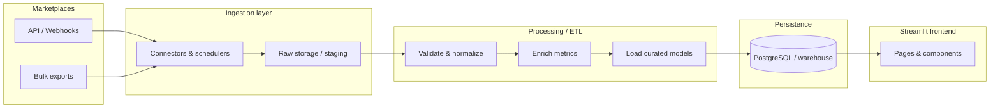

<div align="center">

# 📊 SellerPulse Analytics

**Data-driven seller intelligence for modern marketplaces**

[](https://www.python.org/)
[](https://streamlit.io/)
[](LICENSE)
[](https://github.com/psf/black)

*Turn raw marketplace orders into actionable sales, margin, and tax insights—without leaving your browser.*

</div>

---

## 🎯 Project Title and Description

**SellerPulse Analytics** is a marketplace seller management web application that centralizes order data, validates and enriches it through structured pipelines, and presents it through **interactive Streamlit dashboards**. Sellers gain a single place to monitor performance, drill into product-level economics, understand profitability and taxes, and export reports for accounting or planning.

**Value proposition**

| Pain point | How SellerPulse helps |
|------------|------------------------|
| Orders scattered across portals | Unified import and sync from marketplace APIs or files |
| Hard to see true profit | Net profit, margins, and fee/tax-aware analytics |
| Reactive inventory decisions | Pattern-based inventory signals derived from order history |
| Slow, spreadsheet-heavy workflows | Live dashboards, filters, and one-click exports |

---

## ✅ Functional Requirements

### Data import and synchronization

- **Multi-source ingestion**: Pull or upload order data from supported marketplaces (REST APIs, webhooks where available, scheduled jobs, or bulk CSV/JSON exports).
- **Incremental sync**: Track high-water marks (e.g., last modified order time) to avoid duplicate processing and reduce API load.
- **Schema mapping**: Map marketplace-specific fields to a canonical internal order model (line items, fees, taxes, currency, fulfillment status).

### Data processing and validation

- **Validation rules**: Required fields, numeric ranges, currency consistency, duplicate detection, and referential checks against known products/SKUs.
- **Normalization**: Currency conversion (with configurable rates), tax jurisdiction normalization, and unit-of-measure alignment.
- **Enrichment**: Computed fields such as net profit per line, margin %, and allocated marketplace fees.

### Dashboard views

| Area | Capabilities |
|------|----------------|
| **Sales performance** | Revenue trends, order volume, AOV, cohort or period comparisons, channel/marketplace splits. |
| **Product-level analytics** | Top/bottom SKUs, velocity, mix contribution, returns or cancellations if modeled. |
| **Profitability** | Net profit, gross margin, contribution margin after fees, drill-down by order, product, or time window. |
| **Tax breakdown** | Tax collected/remitted summaries, jurisdiction views, export-friendly tax tables for compliance handoff. |
| **Inventory insights** | Demand signals from order frequency and quantity patterns, reorder hints (non-binding), slow-mover highlights. |

### Export and collaboration

- **Exports**: CSV/Excel for filtered datasets; optional PDF summaries for stakeholders.
- **Saved views** (optional): Named filter presets for recurring reports.

### User management and access control

- **Authentication**: Sign-in integrated with the chosen identity provider (see [Technology Stack](#-technology-stack)).
- **Authorization**: Role-based access (e.g., owner, analyst, read-only); optional multi-tenant isolation so each seller organization sees only its data.

### Streamlit-specific visualization

- **Interactive widgets**: `st.selectbox`, `st.date_input`, `st.slider` for slicing data without code changes.
- **Charts**: Native `st.line_chart` / `st.bar_chart` or Plotly/Altair for custom tooltips and legends.
- **Layout**: `st.columns`, `st.tabs`, and `st.expander` for hierarchical navigation; `st.metric` for KPI cards.
- **Caching**: `st.cache_data` / `st.cache_resource` for expensive queries and model loads to keep the UI responsive.

---

## ⚙️ Non-Functional Requirements

### Performance

- **Dashboard response**: Typical filter or date-range changes should render within **~2–5 seconds** for datasets up to the target tier (tune with pagination and aggregates).
- **Concurrency**: Support **10–50 concurrent Streamlit sessions** at MVP scale; scale out with multiple app replicas behind a load balancer for growth.
- **Batch processing**: Full daily sync + ETL for a medium seller should complete within an agreed SLA (e.g., **&lt; 30–60 minutes** for millions of rows when using columnar storage and chunked pandas/SQL).

### Scalability

- **Volume**: Architecture should scale from thousands to **hundreds of millions** of order lines via partitioning, summary tables, and incremental ETL.
- **Multi-seller**: Logical or physical tenant isolation; horizontal scaling of workers and app instances.

### Security

- **Encryption**: TLS in transit; encryption at rest for database and object storage (e.g., KMS-managed keys).
- **Authentication & authorization**: Centralized identity; least-privilege service accounts for ingestion jobs.
- **Secrets**: No credentials in source control; use environment variables or a secret manager.

### Reliability

- **Data accuracy**: Idempotent ingestion, audit logs for sync runs, reconciliation reports (source vs. warehouse counts).
- **Backups**: Automated DB backups, retention policy, and tested restore procedures; optional point-in-time recovery for production.

### Usability (Streamlit)

- **Progressive disclosure**: Overview first; details in tabs or expanders.
- **Consistent theming**: `config.toml` for colors/fonts; clear page titles and help text.
- **Feedback**: `st.spinner`, `st.toast`, and error banners for failed loads or validation issues.

### Maintainability

- **Structure**: Clear separation of ingestion, domain logic, persistence, and UI (see [Project Structure](#-project-structure)).
- **Documentation**: README, architecture notes, API field mapping docs, and runbooks for deployments and incident response.

### Data privacy and compliance

- **Marketplace agreements**: Honor API terms, data retention limits, and prohibited use cases defined by each marketplace.
- **PII minimization**: Store only fields needed for analytics; mask or tokenize buyer PII where possible.
- **Regulations**: Design with GDPR/CCPA-style requests in mind (export, delete, consent logging) where applicable to your deployment region and customer base.

---

## 🏗️ Solution Architecture

### Backend components

| Layer | Responsibility |
|-------|------------------|
| **Data ingestion** | Connectors (API clients, file watchers), rate limiting, retries, raw landing zone (object storage or staging tables). |
| **Processing / ETL** | Validation, deduplication, normalization, enrichment, loading into curated schemas; orchestrated via cron, Airflow, Dagster, or Prefect (optional). |
| **API layer (optional)** | REST or internal Python services if multiple clients (Streamlit, mobile, integrations) need the same business logic; otherwise Streamlit can call services directly. |
| **Database** | **PostgreSQL** for transactional metadata (users, tenants, sync jobs) and relational order headers; **PostgreSQL + TimescaleDB** or a **columnar warehouse** (e.g., DuckDB for embedded analytics, BigQuery/Snowflake at scale) for heavy analytical queries on large fact tables. |

### Frontend structure (Streamlit)

- **Page organization**: `streamlit run app/Home.py` with a `pages/` directory for multi-page apps (`Sales`, `Products`, `Profitability`, `Taxes`, `Inventory`, `Settings`).
- **Component hierarchy**: Thin pages that compose reusable modules under `src/frontend/components/` (KPI row, filter bar, chart factory, data table).
- **State management**: Prefer **server-side state** (database + cached query results). Use `st.session_state` for UI-only state (filters, pagination keys); avoid storing large datasets in session state.

### Data flow (high level)



1. Marketplaces expose orders via API, webhook, or file export.  
2. Ingestion pulls data into a **raw/staging** area with provenance (source, batch id, timestamp).  
3. ETL validates, normalizes, and computes business metrics, then loads **curated** fact and dimension tables.  
4. Streamlit queries the database (or pre-aggregated views/materialized views) and renders dashboards with caching.

### Integration points

- **OAuth / API keys** per marketplace; token refresh and scoped permissions.
- **Webhooks** (where supported) for near-real-time order updates, complemented by **scheduled backfill** for consistency.
- **Idempotent writes** keyed by marketplace order and line identifiers to handle retries safely.

---

## 🧰 Technology Stack

| Category | Choices |
|----------|---------|
| **Runtime** | Python **3.11+** (3.12 when stable in your environment) |
| **Web UI** | **Streamlit** 1.28+; optional **streamlit-authenticator** or custom OIDC flow |
| **Data processing** | **pandas**, **numpy**; optional **polars** for large in-memory transforms |
| **Validation** | **pandera** or **pydantic** for schemas and pipeline contracts |
| **Database** | **PostgreSQL** with **SQLAlchemy** 2.x / **asyncpg**; **psycopg** for sync paths |
| **Migrations** | **Alembic** |
| **ORM / queries** | SQLAlchemy Core/ORM or raw SQL for performance-critical aggregates |
| **Charts** | **Plotly** or **Altair**; **streamlit-extras** for enhanced UI patterns |
| **Auth** | **Auth0**, **Azure AD**, **AWS Cognito**, or **Keycloak** (OIDC); align with `streamlit-authenticator` only for simpler deployments |
| **Testing** | **pytest**, **pytest-cov**; **httpx** + **respx** for connector tests; optional **Playwright** for E2E if you add a non-Streamlit surface later |
| **Lint / format** | **ruff**, **black**, **mypy** (strictness as appropriate) |
| **Deployment** | **Docker** + container orchestration (ECS, Kubernetes, Cloud Run); reverse proxy with TLS; secrets from env or cloud secret manager |
| **Observability** | Structured logging (**structlog**), OpenTelemetry-compatible traces for ingestion jobs |

**Streamlit configuration**

- `.streamlit/config.toml` for theme, `server.maxUploadSize`, and CORS if needed.  
- **Secrets** in `.streamlit/secrets.toml` locally (never committed); platform equivalents in production.

---

## 📁 Project Structure

Recommended layout for a clean **backend / frontend** split while keeping everything importable as one Python package:

```text
sellerpulse-analytics/
├── .env.example                 # Document required environment variables
├── .gitignore
├── .streamlit/
│   └── config.toml            # Theme, server, and Streamlit options
├── README.md
├── LICENSE
├── pyproject.toml               # Dependencies and tool config (preferred)
├── requirements.txt             # Optional lock/pin file for deployments
├── docker-compose.yml           # Local Postgres + app (optional)
├── Dockerfile
│
├── alembic/                     # DB migrations
│   ├── env.py
│   └── versions/
│
├── src/
│   ├── sellerpulse/             # Main Python package
│   │   ├── __init__.py
│   │   │
│   │   ├── config/              # Settings, feature flags
│   │   │   └── settings.py
│   │   │
│   │   ├── domain/              # Business rules (pure Python)
│   │   │   ├── orders.py
│   │   │   ├── profitability.py
│   │   │   └── taxes.py
│   │   │
│   │   ├── ingestion/           # Marketplace connectors
│   │   │   ├── base.py
│   │   │   └── marketplace_x.py
│   │   │
│   │   ├── pipelines/           # ETL steps (validate → transform → load)
│   │   │   ├── validate.py
│   │   │   ├── enrich.py
│   │   │   └── load.py
│   │   │
│   │   ├── persistence/         # DB models, repositories, SQL
│   │   │   ├── models.py
│   │   │   └── repositories/
│   │   │
│   │   ├── services/            # Orchestration used by UI or API
│   │   │   ├── dashboard_service.py
│   │   │   └── export_service.py
│   │   │
│   │   └── frontend/            # Streamlit-specific helpers (non-page)
│   │       ├── components/      # Reusable UI building blocks
│   │       └── charts.py
│   │
│   └── streamlit_app/           # Streamlit entrypoint and pages
│       ├── Home.py              # Landing / overview
│       └── pages/
│           ├── 1_Sales.py
│           ├── 2_Products.py
│           ├── 3_Profitability.py
│           ├── 4_Taxes.py
│           ├── 5_Inventory.py
│           └── 6_Settings.py
│
├── scripts/                     # CLI utilities (sync jobs, one-off backfills)
│   └── run_sync.py
│
├── tests/
│   ├── unit/
│   ├── integration/
│   └── conftest.py
│
└── docs/
    ├── architecture.md
    └── marketplace_field_mapping.md
```

**Run locally (illustrative)**

```bash
python -m venv .venv
.venv\Scripts\activate          # Windows
pip install -e ".[dev]"
streamlit run src/streamlit_app/Home.py
```

---

## 📜 License

Specify your license in `LICENSE` (e.g., MIT). Marketplace SDKs and data usage remain subject to **third-party terms**.

---

<div align="center">

**SellerPulse Analytics** — *Clarity for every order, margin, and tax line.*

</div>
